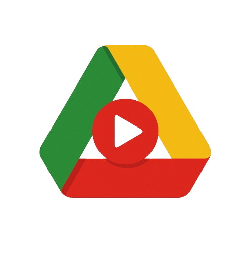

# DriveTube

<div align="center">
  
  <p><strong>Plataforma para distribuir video com controle de acesso, monetizacao e operacao multi-tenant sobre Google Drive.</strong></p>

  <p>
    <a href="https://nodejs.org/en/"></a>
    <a href="https://www.typescriptlang.org/"></a>
    <a href="https://nextjs.org/"></a>
    <a href="https://www.mysql.com/"></a>
  </p>

  <p>
    <a href="#visao-geral">Visao Geral</a> •
    <a href="#casos-de-uso-principais">Casos de Uso</a> •
    <a href="#funcionalidades">Funcionalidades</a> •
    <a href="#arquitetura">Arquitetura</a> •
    <a href="#instalacao">Instalacao</a> •
    <a href="#go-to-market-gtm">Go-to-Market</a>
  </p>
</div>

## Visao Geral

O DriveTube e um produto orientado a negocio para empresas e criadores que precisam:
- hospedar e distribuir videos com controle real do conteudo (Google Drive proprio)
- monetizar via assinatura, pay-per-view e pagamentos cripto
- operar com isolamento de dados por cliente (modelo SaaS/multi-tenant)

Em vez de competir de forma direta com marketplaces de curso generalistas, o DriveTube foca em verticais de maior margem e menor concorrencia.

## Casos de Uso Principais

### 1) Micro-SaaS White-Label para Nichos (Oceano Azul)
Modelo para empreendedores e negocios locais que precisam de uma plataforma propria de treinamento ou cursos pagos.

Exemplos:
- treinamento de equipes comerciais
- capacitacao de franquias
- academias de especializacao (ex.: beleza e estetica)

Valor entregue:
- marca propria do cliente
- menor taxa do que plataformas tradicionais
- controle de base de usuarios e conteudo

### 2) Creator Economy Web3 (Patreon/OnlyFans com privacidade)
Hub premium para criadores com foco em liberdade de monetizacao e privacidade.

Publicos-alvo:
- educadores financeiros
- analistas de cripto
- podcasters independentes
- criadores afetados por desmonetizacao em plataformas tradicionais

Modelo:
- criador publica no proprio Drive
- DriveTube controla o acesso pago
- cobranca por assinatura ou pay-per-view
- microtaxa por transacao para a plataforma

### 3) Portal B2B de Entrega e Aprovacao Audiovisual
Fluxo profissional para produtoras, videomakers e agencias entregarem e aprovarem conteudo com seguranca comercial.

Diferencial:
- preview com marca d'agua
- aprovacao do cliente dentro do portal
- pagamento final (cripto/tradicional)
- liberacao automatica do arquivo final em alta resolucao apos confirmacao

### 4) Hub de Onboarding Corporativo
"Netflix corporativa" para RH e treinamento interno em empresas que ja usam Google Workspace.

Valor entregue:
- organizacao por pastas e trilhas
- acompanhamento de progresso por colaborador
- maior controle sobre treinamentos obrigatorios

## Funcionalidades

### Ja implementadas
- autenticacao com email/senha e Google OAuth
- gerenciamento de videos, playlists e favoritos
- player integrado e interface responsiva
- planos, assinaturas e lista de espera (waitlist)
- integracao de pagamentos cripto com TANOS (USDT)
- base para multiusuario com isolamento de dados

### Em evolucao / roadmap de produto
- consolidacao do multi-tenant completo (tenant por cliente)
- dashboard de analytics para criadores e empresas
- webhook/reconciliacao de pagamentos
- fluxo de aprovacao audiovisual com escrow operacional
- relatorios avancados de onboarding corporativo

## Arquitetura

### Backend
- Node.js + Fastify + TypeScript
- Prisma ORM
- MySQL
- JWT + Zod
- Integracao TANOS para pagamentos cripto

### Frontend
- Next.js (App Router) + React + TypeScript
- Tailwind CSS
- NextAuth.js
- Axios + Zustand

## Estrutura do Projeto

```plaintext
drivetube/
├── backend/      # API Fastify, Prisma, regras de negocio
├── frontend/     # Aplicacao Next.js
├── docs/         # Guias e materiais de produto
├── tanos/        # Integracao e estudos do ecossistema TANOS
└── screenshots/  # Capturas e apoio visual
```

## Instalacao

### Pre-requisitos
- Node.js 18+
- MySQL ativo

### 1. Clonar repositorio

```bash
git clone https://github.com/your-username/drivetube.git
cd drivetube
```

### 2. Instalar dependencias

```bash
npm install
```

### 3. Configurar ambiente

- Criar arquivo `.env` na raiz e nos modulos quando necessario.
- Preencher variaveis de banco, JWT, Google OAuth e integracoes de pagamento.

### 4. Rodar migracoes

```bash
cd backend
npx prisma migrate dev
```

### 5. Subir aplicacao em desenvolvimento

Opcao com Docker:

```bash
docker compose up --build
```

Opcao sem Docker (em terminais separados):

```bash
cd backend
npm run dev
```

```bash
cd frontend
npm run dev
```

## Go-to-Market (GTM)

### Estrategia comercial recomendada
- vender setup + implantacao + manutencao, nao apenas licenca de software
- iniciar por 1 vertical e escalar com casos de sucesso
- usar waitlist para gerar escassez e validar demanda

### Modelo de receita sugerido
- setup fee: R$ 2.000 a R$ 5.000
- mensalidade: a partir de R$ 300/mes
- taxa transacional: em assinatura/pay-per-view

### Canais de aquisicao
- LinkedIn (B2B: RH, agencias, franquias)
- redes e comunidades de nicho (criadores e beleza)
- comunidades Web3 para creator economy

## Documentos Relacionados

- [FEATURES.md](FEATURES.md)
- [checklist.md](checklist.md)
- [PAGAMENTOS_CRYPTO.md](PAGAMENTOS_CRYPTO.md)
- [planejamento.md](planejamento.md)
- [docs/guia-inicio-rapido.md](docs/guia-inicio-rapido.md)

## Roadmap Executivo (Resumo)

- Fase 1: White-label para nicho inicial
- Fase 2: Creator mode com monetizacao robusta
- Fase 3: Portal B2B audiovisual com aprovacao + liberacao automatica
- Fase 4: Onboarding corporativo com analytics

Detalhamento completo no arquivo [planejamento.md](planejamento.md).

## Contribuicao

1. Fork do projeto
2. Criar branch de feature (`git checkout -b feature/minha-feature`)
3. Commit (`git commit -m "feat: minha feature"`)
4. Push (`git push origin feature/minha-feature`)
5. Abrir Pull Request

## Licenca

Distribuido sob a licenca MIT. Veja [LICENSE](LICENSE).
