# 🔐 Guia de Implementação: Wallet TANOS

## 📋 Visão Geral da Arquitetura

```mermaid
graph TB
    subgraph Browser
        E[Extensão Wallet]
        F[Frontend Web App]
    end
    
    subgraph Backend
        A[API Gateway]
        B[Serviço TANOS]
        C[Serviço de Wallet]
        D[(Database)]
    end
    
    E <--> F
    F <--> A
    A <--> B
    A <--> C
    B <--> D
    C <--> D
```



## 🔧 Opções de Implementação

### 1️⃣ Integração Direta no Sistema Web

#### Backend (exemplo em Go)
```go
// wallet/service.go
type WalletService struct {
    tanosClient *tanos.Client
    db         *database.DB
}

func (s *WalletService) CreateWallet() (*Wallet, error) {
    // Criar carteira usando TANOS
    keys := tanos.GenerateKeyPair()
    
    wallet := &Wallet{
        PublicKey: keys.Public,
        // Nunca armazene a chave privada!
        // Apenas o hash para verificação
        KeyHash: hash(keys.Public),
    }
    
    return s.db.SaveWallet(wallet)
}

func (s *WalletService) InitiateSwap(swap SwapRequest) (*SwapSession, error) {
    // Iniciar processo de troca
    session := tanos.NewSwapSession(swap.Amount)
    return s.db.SaveSwapSession(session)
}
```

#### Frontend (React + TypeScript)
```typescript
// components/Wallet.tsx
interface WalletProps {
    onTransaction: (tx: Transaction) => void;
}

const Wallet: React.FC<WalletProps> = ({ onTransaction }) => {
    const [balance, setBalance] = useState<string>("0");
    const [isSwapping, setIsSwapping] = useState(false);

    const initiateSwap = async () => {
        setIsSwapping(true);
        try {
            const session = await api.createSwapSession({
                amount: "0.1",
                type: "BTC_TO_NOSTR"
            });
            
            // Mostrar QR code ou endereço para pagamento
            showPaymentDialog(session);
        } catch (err) {
            console.error("Erro ao iniciar swap:", err);
        }
        setIsSwapping(false);
    };

    return (
        <div className="wallet-container">
            <h2>Sua Carteira TANOS</h2>
            <div className="balance">
                <span>Saldo: {balance} BTC</span>
            </div>
            <button 
                onClick={initiateSwap}
                disabled={isSwapping}
            >
                Iniciar Nova Troca
            </button>
        </div>
    );
};
```

### 2️⃣ Extensão de Navegador (Similar ao MetaMask)

#### Estrutura da Extensão
```
tanos-wallet-extension/
├── manifest.json
├── src/
│   ├── background/
│   │   └── service.ts
│   ├── content/
│   │   └── inject.ts
│   ├── popup/
│   │   ├── App.tsx
│   │   └── index.html
│   └── lib/
│       └── tanos-client.ts
└── public/
    └── icons/
```

#### Manifest V3 (manifest.json)
```json
{
  "manifest_version": 3,
  "name": "TANOS Wallet",
  "version": "1.0.0",
  "description": "Carteira segura para trocas atômicas Bitcoin/Nostr",
  "permissions": [
    "storage",
    "tabs",
    "activeTab"
  ],
  "action": {
    "default_popup": "popup/index.html",
    "default_icon": {
      "16": "icons/icon16.png",
      "48": "icons/icon48.png",
      "128": "icons/icon128.png"
    }
  },
  "background": {
    "service_worker": "background/service.js"
  },
  "content_scripts": [{
    "matches": ["<all_urls>"],
    "js": ["content/inject.js"]
  }]
}
```

#### Background Service (TypeScript)
```typescript
// background/service.ts
class TANOSWalletService {
    private wallet: TANOSWallet | null = null;

    async initialize() {
        // Recuperar ou criar nova wallet
        this.wallet = await this.loadOrCreateWallet();
        
        // Escutar mensagens do content script
        chrome.runtime.onMessage.addListener(
            this.handleMessage.bind(this)
        );
    }

    private async handleMessage(
        message: WalletMessage,
        sender: chrome.runtime.MessageSender,
        sendResponse: (response: any) => void
    ) {
        switch (message.type) {
            case "INITIATE_SWAP":
                return this.handleSwapRequest(message.payload);
            case "SIGN_TRANSACTION":
                return this.signTransaction(message.payload);
            // ... outros handlers
        }
    }

    private async handleSwapRequest(request: SwapRequest) {
        // Criar sessão de troca
        const session = await this.createSwapSession(request);
        
        // Mostrar notificação na extensão
        this.showSwapNotification(session);
        
        return session;
    }
}
```

#### Interface da Extensão (React + TypeScript)
```typescript
// popup/App.tsx
const WalletPopup: React.FC = () => {
    const [activeSwaps, setActiveSwaps] = useState<SwapSession[]>([]);
    const [selectedNetwork, setSelectedNetwork] = useState<Network>("mainnet");

    useEffect(() => {
        // Carregar swaps ativos
        loadActiveSwaps();
    }, []);

    const handleNewSwap = async () => {
        const swap = await chrome.runtime.sendMessage({
            type: "CREATE_SWAP_SESSION"
        });
        
        setActiveSwaps(prev => [...prev, swap]);
    };

    return (
        <div className="wallet-popup">
            <header>
                <NetworkSelector 
                    value={selectedNetwork}
                    onChange={setSelectedNetwork}
                />
            </header>

            <main>
                <SwapsList swaps={activeSwaps} />
                <button onClick={handleNewSwap}>
                    Nova Troca
                </button>
            </main>
        </div>
    );
};
```

## 🔄 Fluxo de Comunicação

1. **Web App ↔️ Extensão**
```typescript
// No seu web app
declare global {
    interface Window {
        tanos?: TANOSProvider;
    }
}

// Detectar extensão
if (window.tanos) {
    // Iniciar troca
    const swap = await window.tanos.initiateSwap({
        amount: "0.1",
        type: "BTC_TO_NOSTR"
    });
}
```

2. **Extensão ↔️ Background Service**
```typescript
// content/inject.ts
window.tanos = {
    async initiateSwap(request: SwapRequest) {
        return chrome.runtime.sendMessage({
            type: "INITIATE_SWAP",
            payload: request
        });
    }
};
```

## 🎨 Design da Interface

### Popup da Extensão
```jsx
const WalletHeader = styled.header`
    padding: 16px;
    border-bottom: 1px solid #eee;
    display: flex;
    justify-content: space-between;
`;

const SwapCard = styled.div`
    margin: 8px;
    padding: 16px;
    border: 1px solid #ddd;
    border-radius: 8px;
    
    &:hover {
        box-shadow: 0 2px 4px rgba(0,0,0,0.1);
    }
`;

const ActionButton = styled.button`
    background: #1a73e8;
    color: white;
    padding: 8px 16px;
    border-radius: 4px;
    border: none;
    
    &:hover {
        background: #1557b0;
    }
`;
```

## 📱 Responsividade

```typescript
// hooks/useResponsive.ts
const useResponsive = () => {
    const [width, setWidth] = useState(window.innerWidth);
    
    useEffect(() => {
        const handleResize = () => setWidth(window.innerWidth);
        window.addEventListener('resize', handleResize);
        return () => window.removeEventListener('resize', handleResize);
    }, []);
    
    return {
        isMobile: width < 768,
        isTablet: width >= 768 && width < 1024,
        isDesktop: width >= 1024
    };
};
```

## 🔒 Segurança

1. **Armazenamento Seguro**
```typescript
// lib/secure-storage.ts
class SecureStorage {
    private async encrypt(data: any): Promise<string> {
        // Usar Web Crypto API para encriptar dados
        const key = await this.getEncryptionKey();
        // ... lógica de encriptação
    }
    
    private async decrypt(encrypted: string): Promise<any> {
        // Decriptar dados usando Web Crypto API
        const key = await this.getEncryptionKey();
        // ... lógica de decriptação
    }
    
    async saveWallet(wallet: Wallet): Promise<void> {
        const encrypted = await this.encrypt(wallet);
        chrome.storage.local.set({ wallet: encrypted });
    }
}
```

2. **Verificação de Origem**
```typescript
// background/security.ts
const verifyOrigin = (origin: string): boolean => {
    const allowedOrigins = [
        'https://seu-app.com',
        'https://api.seu-app.com'
    ];
    
    return allowedOrigins.includes(origin);
};
```

## 📦 Deploy

1. **Empacotar Extensão**
```bash
# Buildar extensão
npm run build

# Criar arquivo ZIP para Chrome Web Store
zip -r tanos-wallet.zip dist/*
```

2. **Publicar na Chrome Web Store**
- Upload do arquivo ZIP
- Preencher informações da extensão
- Enviar para revisão

## 🚀 Próximos Passos

1. **Melhorias Futuras**
   - Suporte a múltiplas redes
   - Integração com hardware wallets
   - Backup automatizado
   - Histórico de transações

2. **Considerações de Segurança**
   - Auditorias regulares
   - Testes de penetração
   - Atualizações de segurança

3. **Expansão**
   - Suporte a outros navegadores
   - Versão mobile
   - Integrações com DApps

## 📚 Recursos Adicionais

- [Documentação Chrome Extensions](https://developer.chrome.com/docs/extensions/)
- [Guia de Segurança Web3](link)
- [Melhores Práticas TANOS](link)
- [Comunidade de Desenvolvedores](link)